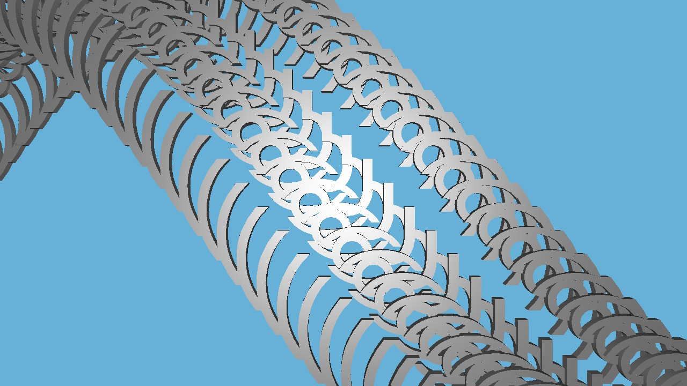

# Hybrid Switch/PC Example Application

This is an example OpenGL project using GLFW and GLM that builds and runs on both Switch and PC.



## Features

- Uses OpenGL 4.3 (Core Profile)
- Loads shaders from the `resources` folder, or from RomFS on Switch
- Uses nxlink stdio on Switch to provide terminal output for debugging messages
- Has minimal platform-specific code
- Supports full-screen mode on PC (pressing Alt+Enter)
- Supports dynamic resolution changes (i.e. window resizes, or Switch docked/handheld mode changes)
- Supports gamepads on PC (such as Xbox controllers), or keyboard as fallback when no gamepads are detected
- Displays a world full of ( ͡° ͜ʖ ͡°)

## Building for Switch

To build for Switch, a standard development environment must first be set up. In order to do so, [refer to the Getting Started guide](https://devkitpro.org/wiki/Getting_Started).

```bash
(sudo) (dkp-)pacman -S switch-glfw switch-mesa switch-glm
make -j
nxlink -s hybrid_app.nro
```

## Building for PC

To build for PC, the following components are required:

- meson/ninja build system
- A C++ compiler supporting the C++14 standard
- GLFW version 3.3 or higher (as a static library)
- GLM version 0.9.8 or higher

Please refer to the usual sources of information for your particular operating system. Usually the commands needed to build this project will look like this:

```bash
meson build
ninja -C build
./build/hybrid_app
```

Also, please note that the `resources` folder must be available in the working directory, otherwise the program will fail to find the shaders.

### Building for Windows using msys2

msys2 provides all packages needed to build this project:

```bash
pacman -S mingw-w64-x86_64-gcc mingw-w64-x86_64-meson mingw-w64-x86_64-ninja mingw-w64-x86_64-pkg-config mingw-w64-x86_64-glfw mingw-w64-x86_64-glm
LDFLAGS="-static" meson build
ninja -C build
./build/hybrid_app
```
